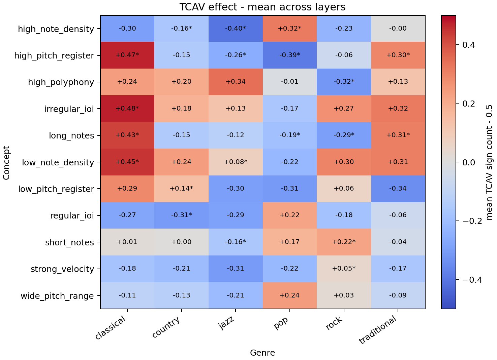
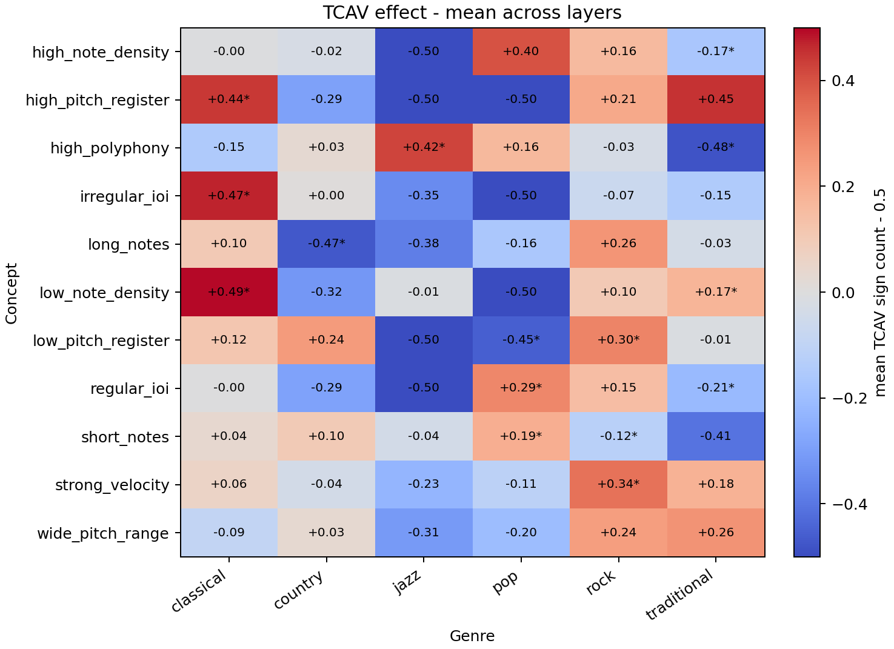
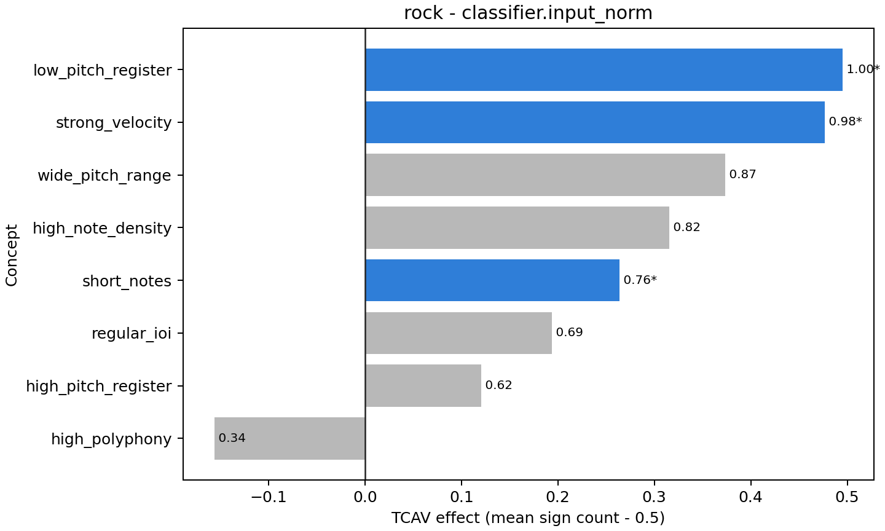
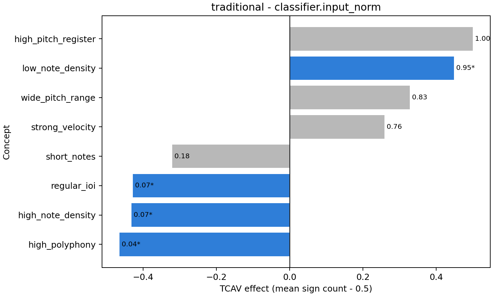

# Raport finalny - interpretowalność klasyfikatora gatunku na muzyce symbolicznej

Michał Podgajny 311412,
Miłosz Andruczyk 313525,
Aleksander Szymczyk 325239

## Opis projektu

Projekt dotyczy klasyfikacji gatunku muzycznego na podstawie plików MIDI oraz analizy tego, jakie cechy muzyczne model uznaje za charakterystyczne dla poszczególnych gatunków. Głównym celem nie było wyłącznie uzyskanie jak najwyższej skuteczności klasyfikacji, ale także przejście od samej predykcji do interpretacji decyzji modelu.

Inspiracją była praca Foscarina et al. (2022), w której metoda TCAV została wykorzystana do interpretacji modeli rozpoznających kompozytorów. W tym projekcie analogiczny pomysł przeniesiono na klasyfikację gatunków muzycznych. Zamiast analizować pojedyncze nuty lub aktywacje bez znaczenia muzycznego, zdefiniowano zrozumiałe koncepty, takie jak wysoka gęstość nut, niski rejestr, długa średnia długość nut czy nieregularny rytm.

W ramach projektu przygotowano pełny pipeline eksperymentalny:

- pobranie i preprocessing danych MIDI,
- ekstrakcję cech symbolicznych,
- analizę eksploracyjną zbioru,
- trening klasycznych modeli uczenia maszynowego,
- trening modeli neuronowych opartych na piano-rollu i sekwencjach nut,
- fine-tuning modelu MusicBERT,
- analizę interpretowalności metodą TCAV.

## Funkcjonalność programu

System ma charakter badawczo-eksperymentalny. Jest uruchamiany z poziomu linii poleceń i konfigurowany za pomocą plików Hydra, co pozwala odtwarzać eksperymenty oraz porównywać różne warianty modeli.

Najważniejsze funkcjonalności obejmują:

- wczytywanie i walidację plików MIDI,
- konwersję plików MIDI do wspólnej reprezentacji numerycznej,
- budowę zbiorów danych dla modeli klasycznych, MuSeReNet, Transformera i MusicBERT,
- ekstrakcję cech muzycznych wykorzystywanych zarówno do klasyfikacji, jak i do definicji konceptów TCAV,
- trening i ewaluację modeli klasyfikujących gatunek,
- rejestrowanie wyników w Weights & Biases,
- obsługę konfiguracji eksperymentów przez Hydra,
- uruchamianie eksperymentów na klastrze przez skrypty Slurm,
- analizę interpretowalności modelu metodą TCAV,
- generowanie tabel, wykresów i podsumowań wyników.

W przeprowadzonych eksperymentach wykorzystano jeden główny dataset, XMIDI. Architektura kodu pozwala natomiast na zastosowanie tego samego pipeline'u do kolejnych zbiorów MIDI, co byłoby naturalnym rozszerzeniem projektu w kierunku porównywania "definicji gatunku" zakodowanych w różnych datasetach.

## Użyte narzędzia

Do przetwarzania plików MIDI wykorzystano bibliotekę `partitura`, ponieważ dobrze wspiera analizę muzyki symbolicznej i była zgodna z kierunkiem pracy Foscarina et al. W projekcie wykorzystano także:

- `pandas` i `numpy` - przetwarzanie danych tabelarycznych oraz numerycznych,
- `partitura` - wczytywanie MIDI i ekstrakcja reprezentacji symbolicznych,
- `scikit-learn` - modele klasyczne, metryki i klasyfikator CAV,
- `PyTorch` - implementacja i trening modeli neuronowych,
- `transformers` - integracja modelu MusicBERT przez Hugging Face,
- `miditok` - tokenizacja MIDI do reprezentacji REMI dla MusicBERT,
- `Captum` - implementacja TCAV,
- `matplotlib` - wizualizacja wyników,
- `Hydra` - zarządzanie konfiguracjami eksperymentów,
- `Weights & Biases` - logowanie metryk i porównywanie runów,
- `Slurm` - uruchamianie dłuższych eksperymentów na GPU,
- `ruff`, `pytest`, `uv` i `make` - organizacja środowiska, formatowanie, testy i automatyzacja zadań.

## Dane

Do eksperymentów wykorzystano zbiór **XMIDI**. Pliki MIDI mają etykiety gatunku oraz emocji, dzięki czemu można analizować zarówno cechy stylistyczne, jak i rozkład dodatkowych metadanych. W tym projekcie głównym zadaniem była klasyfikacja gatunku, dlatego etykiety emocji wykorzystano wyłącznie w analizie eksploracyjnej.

Aktualnie przetworzony zbiór użyty w eksperymentach zawiera **52 421 próbek**. Dane nie zawierają braków w kolumnach metadanych i nie zawierają zduplikowanych identyfikatorów `sample_id`.

### Rozkład gatunków

Zbiór jest niezbalansowany. Najliczniejsze klasy to `rock`, `pop` i `country`, natomiast najmniej liczna jest klasa `traditional`.

| Gatunek | Liczba próbek | Udział [%] |
|---|---:|---:|
| rock | 13 007 | 24.81 |
| pop | 12 380 | 23.62 |
| country | 11 539 | 22.01 |
| jazz | 7 697 | 14.68 |
| classical | 6 047 | 11.54 |
| traditional | 1 751 | 3.34 |

Nierównowaga klas jest jednym z głównych ograniczeń eksperymentu. Szczególnie problematyczna jest klasa `traditional`, która ma ponad siedmiokrotnie mniej próbek niż klasy `rock` lub `pop`.

### Rozkład emocji

Etykiety emocji nie były celem klasyfikacji, ale pokazują dodatkową strukturę datasetu.

| Emocja | Liczba próbek | Udział [%] |
|---|---:|---:|
| exciting | 10 227 | 19.51 |
| warm | 7 284 | 13.90 |
| happy | 6 460 | 12.32 |
| romantic | 6 182 | 11.79 |
| funny | 6 076 | 11.59 |
| sad | 4 396 | 8.39 |
| angry | 4 244 | 8.10 |
| lazy | 2 242 | 4.28 |
| quiet | 2 117 | 4.04 |
| fear | 1 772 | 3.38 |
| magnificent | 1 421 | 2.71 |

### Preprocessing

Każdy plik MIDI został wczytany i zapisany do formatu `.npz` zawierającego podstawowe informacje o nutach:

- `pitch` - wysokość dźwięku,
- `onset_sec` - czas rozpoczęcia nuty,
- `duration_sec` - czas trwania nuty,
- `velocity` - dynamika,
- `track` - numer ścieżki,
- `channel` - kanał MIDI.

Na podstawie tych danych utworzono kilka reprezentacji:

- **cechy tabularne** dla modeli klasycznych,
- **piano-roll** dla MuSeReNet,
- **macierz nut** dla MIDI Transformera,
- **tokeny REMI** dla MusicBERT.

### Cechy muzyczne

Dla modeli klasycznych oraz do definicji konceptów TCAV wyekstrahowano cechy opisujące strukturę muzyczną utworów:

- liczba nut,
- czas trwania utworu,
- gęstość nut,
- średnia i maksymalna polifonia,
- średnia, odchylenie i zakres wysokości dźwięków,
- statystyki długości nut,
- statystyki velocity,
- średnia i odchylenie inter-onset interval,
- histogram klas wysokości dźwięków.

Analiza eksploracyjna pokazała, że cechy te niosą informację o gatunku, ale same nie rozdzielają klas idealnie. Na projekcji PCA klasy częściowo się nakładały, co potwierdza, że zadanie klasyfikacji jest nietrywialne.

Najważniejsze obserwacje z eksploracji danych:

- `pop` wyróżniał się wysoką liczbą nut i dużą gęstością zdarzeń,
- `country` miał relatywnie wysoką średnią polifonię,
- `classical` częściej wykazywał wyższy rejestr i dłuższe wartości rytmiczne,
- `traditional` miał niższą gęstość nut i spokojniejszy przebieg,
- `jazz` wykazywał większą zmienność wysokości dźwięków,
- profile pitch-class różniły się między gatunkami, choć nie wystarczały do jednoznacznego rozróżnienia klas.

Wygenerowane wykresy EDA znajdują się w katalogu `reports/figures/xmidi_eda`.

## Reprezentacje wejściowe

### Cechy tabularne

Modele klasyczne otrzymują jeden wektor cech dla całego utworu. Jest to reprezentacja mało kosztowna obliczeniowo i łatwa do interpretacji, ale traci szczegółową informację o kolejności zdarzeń muzycznych.

### Piano-roll

Reprezentacja piano-roll opisuje aktywność wysokości dźwięków w czasie. Oś pozioma odpowiada czasowi, a oś pionowa wysokościom MIDI. Taka reprezentacja zachowuje lokalne wzorce melodyczno-rytmiczne i może być traktowana podobnie do obrazu, dlatego dobrze pasuje do modeli konwolucyjnych.

W projekcie piano-roll wykorzystano jako wejście modelu MuSeReNet.

### Macierz nut

Dla MIDI Transformera każdy utwór reprezentowany jest jako sekwencja nut. Każda nuta opisana jest sześcioma cechami:

| Cecha | Znaczenie |
|---|---|
| `pitch` | wysokość dźwięku MIDI |
| `onset_sec` | czas rozpoczęcia nuty |
| `duration_sec` | czas trwania nuty |
| `velocity` | dynamika |
| `track` | numer ścieżki |
| `channel` | kanał MIDI |

Sekwencje mają różną długość, dlatego są przycinane lub uzupełniane paddingiem do stałej długości `max_notes`. Model otrzymuje także maskę wskazującą rzeczywiste nuty.

### REMI i MusicBERT

MusicBERT wymaga tokenizacji MIDI do reprezentacji symbolicznej. W projekcie użyto tokenizacji REMI, która zamienia muzykę na sekwencję tokenów opisujących między innymi pozycje rytmiczne, wysokości, długości i velocity. Długie utwory są dzielone na okna tokenów. W treningu stosowane jest przycinanie do maksymalnej długości, a w ewaluacji deterministyczne okna, dzięki czemu model może oceniać dłuższe pliki w bardziej stabilny sposób.

## Modele

### Modele klasyczne

Jako punkt odniesienia wykorzystano modele trenowane na cechach tabularnych:

- Logistic Regression,
- Linear SVC,
- SVC,
- KNN,
- Random Forest,
- MLP.

Ich celem było sprawdzenie, ile informacji o gatunku da się odzyskać z prostych, ręcznie zaprojektowanych cech symbolicznych.

### MuSeReNet

MuSeReNet jest modelem konwolucyjnym działającym na piano-rollu. Model analizuje lokalne wzorce w przebiegu utworu, takie jak powtarzalne motywy, zagęszczenia nut, zmiany rejestru i fragmenty o większej polifonii. W projekcie przetestowano wariant bazowy oraz większy wariant modelu.

### MIDI Transformer

MIDI Transformer analizuje sekwencję nut opisaną cechami numerycznymi. W założeniu powinien modelować relacje czasowe między zdarzeniami muzycznymi. W praktyce długie sekwencje MIDI i duża liczba nut w utworach okazały się trudne dla modelu trenowanego od zera.

### MusicBERT

MusicBERT jest modelem wstępnie trenowanym na muzyce symbolicznej. W projekcie użyto go przez Hugging Face, dodając własną głowicę klasyfikacyjną do predykcji gatunku. Przetestowano dwa warianty:

- **MusicBERT full fine-tuning** - aktualizowane są wagi encodera i głowicy,
- **MusicBERT frozen head** - encoder jest zamrożony, trenowana jest głównie głowica klasyfikacyjna.

Pełny fine-tuning MusicBERT dał najlepszy wynik, ale był zdecydowanie najbardziej kosztowny obliczeniowo.

## Ewaluacja modeli

Modele oceniano na tym samym zbiorze walidacyjnym zawierającym **10 485 przykładów**. Ze względu na silne niezbalansowanie klas główną metryką porównawczą jest **macro F1**, ponieważ traktuje wszystkie klasy równorzędnie i nie jest zdominowana przez najliczniejsze gatunki.

Dla modeli neuronowych raportowane są najlepsze wartości `val_f1_macro` zaobserwowane w trakcie treningu, a nie wyłącznie wynik z ostatniej epoki.

| Model / run | Reprezentacja | Best val macro-F1 | Epoka | Val accuracy |
|---|---|---:|---:|---:|
| MusicBERT full fine-tuning | REMI tokens | **0.588** | 5 | 0.622 |
| Random Forest | cechy tabularne | **0.562** | - | 0.614 |
| MuSeReNet, większy wariant | piano-roll | **0.507** | 36 | 0.551 |
| MuSeReNet, wariant bazowy | piano-roll | **0.485** | 46 | 0.531 |
| MusicBERT frozen head | REMI tokens | **0.456** | 4 | 0.507 |
| SVC | cechy tabularne | **0.450** | - | 0.471 |
| MLP | cechy tabularne | **0.436** | - | 0.485 |
| KNN | cechy tabularne | **0.431** | - | 0.472 |
| Logistic Regression | cechy tabularne | **0.395** | - | 0.412 |
| Linear SVC | cechy tabularne | **0.389** | - | 0.440 |
| MIDI Transformer | sekwencja nut | **0.387** | 20 | 0.465 |

Najlepszy wynik uzyskał MusicBERT po pełnym fine-tuningu. Potwierdza to wartość wykorzystania wstępnie trenowanych encoderów dla muzyki symbolicznej. Jednocześnie bardzo dobry wynik Random Forest pokazuje, że ręcznie zaprojektowane cechy symboliczne zawierają dużo informacji o gatunku. Jest to ważne także z punktu widzenia interpretowalności, ponieważ te same cechy można wykorzystać do definiowania muzycznych konceptów.

### Modele klasyczne

| Model | Train accuracy | Val accuracy | Train macro-F1 | Val macro-F1 | Różnica F1 |
|---|---:|---:|---:|---:|---:|
| Random Forest | 0.996 | 0.614 | 0.996 | 0.562 | 0.434 |
| SVC | 0.511 | 0.471 | 0.497 | 0.450 | 0.047 |
| MLP | 0.588 | 0.485 | 0.537 | 0.436 | 0.101 |
| KNN | 0.605 | 0.472 | 0.557 | 0.431 | 0.125 |
| Logistic Regression | 0.420 | 0.412 | 0.400 | 0.395 | 0.005 |
| Linear SVC | 0.442 | 0.440 | 0.390 | 0.389 | 0.001 |

Random Forest uzyskał najlepszy wynik wśród modeli klasycznych, ale bardzo duża różnica między wynikiem treningowym i walidacyjnym wskazuje na overfitting. SVC osiągnął niższy wynik, ale generalizował stabilniej. Modele liniowe miały najmniejszą różnicę między treningiem i walidacją, ale były zbyt proste, aby uchwycić bardziej złożone zależności.

### MuSeReNet i Transformer

| Metryka | MuSeReNet bazowy | MIDI Transformer |
|---|---:|---:|
| Accuracy | 0.53 | 0.46 |
| Macro precision | 0.50 | 0.40 |
| Macro recall | 0.48 | 0.39 |
| Macro F1 | 0.48 | 0.39 |
| Weighted F1 | 0.52 | 0.45 |

MuSeReNet był wyraźnie skuteczniejszy niż testowany MIDI Transformer. Sugeruje to, że w tej konfiguracji reprezentacja piano-roll była łatwiejsza do wykorzystania niż długa sekwencja nut. Transformer miał szczególnie duży problem z klasami `jazz` i `traditional`.

| Gatunek | Support | MuSeReNet F1 | Transformer F1 | Różnica |
|---|---:|---:|---:|---:|
| classical | 1 209 | 0.62 | 0.63 | -0.01 |
| country | 2 308 | 0.54 | 0.49 | +0.05 |
| jazz | 1 540 | 0.52 | 0.26 | +0.26 |
| pop | 2 476 | 0.52 | 0.48 | +0.04 |
| rock | 2 602 | 0.53 | 0.47 | +0.06 |
| traditional | 350 | 0.15 | 0.00 | +0.15 |

Najtrudniejszą klasą była `traditional`. Ma ona najmniejszy support i oba modele miały problem z jej rozpoznaniem. Niska wartość macro F1 względem weighted F1 potwierdza, że modele radzą sobie lepiej z klasami liczniejszymi niż z klasą mniejszościową.

### MusicBERT

MusicBERT uzyskał najlepszy wynik całego projektu:

- best val macro-F1: **0.588**,
- val accuracy: **0.622**,
- najlepsza zaobserwowana epoka: **5**.

Wynik ten był lepszy od Random Forest o około 0.027 macro-F1 oraz od bazowego MuSeReNet o około 0.103 macro-F1. Wariant z zamrożonym encoderem osiągnął niższy wynik macro-F1 równy 0.456.

## Analiza błędów

Najważniejszym źródłem błędów była nierównowaga klas. Klasa `traditional` stanowi tylko 3.34% zbioru, co przekłada się na niski support w walidacji i bardzo słabe wyniki dla tej klasy. Modele częściej poprawnie rozpoznawały klasy liczne, takie jak `rock`, `pop` i `country`.

Drugim problemem jest częściowe nakładanie się cech muzycznych między gatunkami. Analiza PCA oraz wyniki modeli klasycznych pokazują, że cechy symboliczne są informatywne, ale nie tworzą prostych, liniowo rozdzielnych grup. Dotyczy to szczególnie gatunków popularnych, które mogą dzielić podobne schematy rytmiczne, rejestry i gęstości nut.

W praktyce oznacza to, że błędne klasyfikacje nie wynikają wyłącznie z niedoskonałości architektury, ale także z natury danych: gatunki muzyczne nie są kategoriami ostro oddzielonymi, a dataset może kodować uproszczone lub specyficzne dla źródła definicje gatunków.

## Interpretowalność TCAV

Do interpretacji modelu wykorzystano metodę **TCAV** (*Testing with Concept Activation Vectors*). TCAV sprawdza, czy przesunięcie reprezentacji modelu w kierunku określonego konceptu zwiększa wynik dla danej klasy. Dzięki temu można pytać model o pojęcia zrozumiałe muzycznie, np. czy wysoka gęstość nut wspiera klasyfikację jako `pop`.

### Koncepty

Koncepty zdefiniowano na podstawie cech symbolicznych:

- `high_note_density` i `low_note_density`,
- `high_polyphony`,
- `wide_pitch_range`,
- `high_pitch_register` i `low_pitch_register`,
- `strong_velocity`,
- `long_notes` i `short_notes`,
- `irregular_ioi` i `regular_ioi`.

Dla każdego konceptu utworzono manifest próbek reprezentujących dany ogon rozkładu cechy. Następnie porównywano je z losowymi kontrolami. CAV był trenowany jako liniowy klasyfikator rozdzielający koncept od kontroli.

### Konfiguracja TCAV

Analizę TCAV wykonano dla dwóch modeli: MuSeReNet oraz MusicBERT. W obu przypadkach użyto tego samego zestawu 11 konceptów muzycznych, 6 klas gatunków i 10 losowych kontroli na koncept. Dla każdego modelu wykonano **132 testy TCAV**. Do oceny istotności wykorzystano test statystyczny względem wartości 0.5 oraz skorygowany próg istotności `alpha = 0.000379`.

| Model | Warstwy | Liczba testów | Istotne wyniki | Pozytywne | Negatywne |
|---|---|---:|---:|---:|---:|
| MuSeReNet | `classifier.1`, `classifier.2` | 132 | 20 | 10 | 10 |
| MusicBERT | `classifier.input_norm`, `classifier.activation_0` | 132 | 15 | 10 | 5 |

### MuSeReNet TCAV

Dla MuSeReNet wszystkie istotne wyniki pojawiły się w warstwie `classifier.1`. Warstwa `classifier.2` nie dała istotnych wyników po korekcji.

Najważniejsze sygnały:

- `pop` był dodatnio powiązany z wysoką gęstością nut,
- `rock` był dodatnio powiązany z krótszymi nutami i silniejszym velocity,
- `classical` był dodatnio powiązany z wysokim rejestrem, długimi nutami, niższą gęstością i nieregularnym IOI,
- `traditional` był dodatnio powiązany z wysokim rejestrem i długimi nutami.

| Gatunek | Koncept | Warstwa | Mean sign count | Kierunek |
|---|---|---|---:|---|
| classical | high_pitch_register | classifier.1 | 0.938 | pozytywny |
| classical | irregular_ioi | classifier.1 | 0.953 | pozytywny |
| classical | long_notes | classifier.1 | 0.952 | pozytywny |
| classical | low_note_density | classifier.1 | 0.898 | pozytywny |
| pop | high_note_density | classifier.1 | 0.839 | pozytywny |
| rock | short_notes | classifier.1 | 0.744 | pozytywny |
| rock | strong_velocity | classifier.1 | 0.692 | pozytywny |
| traditional | high_pitch_register | classifier.1 | 0.791 | pozytywny |
| traditional | long_notes | classifier.1 | 0.721 | pozytywny |

### MusicBERT TCAV

Dla MusicBERT istotne wyniki pojawiły się w warstwie `classifier.input_norm`, czyli na wejściu do głowicy klasyfikacyjnej. Warstwa `classifier.activation_0` nie dała istotnych wyników po korekcji.

Najważniejsze sygnały:

- `classical` był dodatnio powiązany z wysokim rejestrem, nieregularnym IOI i niską gęstością nut,
- `jazz` był dodatnio powiązany z wysoką polifonią,
- `pop` był dodatnio powiązany z regularnym IOI i krótkimi nutami,
- `rock` był dodatnio powiązany z niskim rejestrem, krótkimi nutami i silniejszym velocity,
- `traditional` był dodatnio powiązany z niską gęstością nut, a negatywnie z wysoką gęstością, wysoką polifonią i regularnym IOI.

| Gatunek | Koncept | Warstwa | Mean sign count | Kierunek |
|---|---|---|---:|---|
| classical | high_pitch_register | classifier.input_norm | 0.984 | pozytywny |
| classical | irregular_ioi | classifier.input_norm | 0.942 | pozytywny |
| classical | low_note_density | classifier.input_norm | 0.988 | pozytywny |
| jazz | high_polyphony | classifier.input_norm | 0.948 | pozytywny |
| pop | regular_ioi | classifier.input_norm | 0.978 | pozytywny |
| pop | short_notes | classifier.input_norm | 0.983 | pozytywny |
| rock | low_pitch_register | classifier.input_norm | 0.995 | pozytywny |
| rock | short_notes | classifier.input_norm | 0.764 | pozytywny |
| rock | strong_velocity | classifier.input_norm | 0.977 | pozytywny |
| traditional | high_note_density | classifier.input_norm | 0.069 | negatywny |
| traditional | high_polyphony | classifier.input_norm | 0.036 | negatywny |
| traditional | low_note_density | classifier.input_norm | 0.948 | pozytywny |
| traditional | regular_ioi | classifier.input_norm | 0.072 | negatywny |

### Porównanie MuSeReNet i MusicBERT

Oba modele wskazały kilka podobnych zależności. Dla `rock` wspólnym sygnałem były krótsze nuty i silniejsze velocity. Dla `classical` oba modele wskazywały znaczenie wysokiego rejestru, niższej gęstości i nieregularności rytmicznej. Dla `traditional` oba modele wskazywały na związek z rzadszą fakturą muzyczną.

Różnice są równie istotne. MuSeReNet mocniej łączył `pop` z wysoką gęstością nut, natomiast MusicBERT wskazał raczej regularne odstępy czasowe i krótkie nuty. MusicBERT wyróżnił też `jazz` przez wysoką polifonię, czego nie było wśród istotnych pozytywnych wyników MuSeReNet. Oznacza to, że modele uczą się częściowo podobnych, ale nie identycznych "definicji gatunku".

Należy podkreślić, że TCAV opisuje **wrażliwość konkretnego modelu**, a nie obiektywną definicję gatunku muzycznego. Wyniki mówią, jakie koncepty są istotne dla danej architektury i checkpointu.

### Wizualizacje TCAV

Poniżej umieszczono najważniejsze wykresy dla obu modeli.

**Rysunek 1. MuSeReNet - zbiorcza heatmapa TCAV**

**Rysunek 2. MusicBERT - zbiorcza heatmapa TCAV**

**Rysunek 3. MuSeReNet - najważniejsze koncepty dla `rock`**

**Rysunek 4. MusicBERT - najważniejsze koncepty dla `rock`**

**Rysunek 5. MusicBERT - najważniejsze koncepty dla `traditional`**

## Zużyte zasoby

Eksperymenty uruchamiano na klastrze z użyciem GPU NVIDIA A100.

Łączny koszt obliczeniowy oszacowano na około **75 GPU-godzin**.

## Wnioski

Projekt pokazał, że klasyfikacja gatunku na danych MIDI jest możliwa, ale trudna ze względu na nierównowagę klas i częściowe nakładanie się cech muzycznych między gatunkami.

Najlepszy wynik klasyfikacyjny uzyskał **MusicBERT full fine-tuning** z macro-F1 równym **0.588**. Potwierdza to, że wstępnie trenowane modele muzyczne są bardziej efektywne niż architektury trenowane od zera na tym zbiorze.

Bardzo mocnym punktem odniesienia okazał się **Random Forest**, który na ręcznie zaprojektowanych cechach osiągnął macro-F1 równe **0.562**. Oznacza to, że cechy symboliczne, takie jak gęstość nut, polifonia, rejestr i długość nut, zawierają dużą część informacji potrzebnej do rozpoznawania gatunku.

Spośród modeli trenowanych od zera lepszy był **MuSeReNet** oparty na piano-rollu. MIDI Transformer miał większe problemy z klasami mniejszościowymi.

Analiza TCAV umożliwiła przejście od samej skuteczności modelu do interpretacji jego decyzji. MuSeReNet i MusicBERT wykazały częściowo wspólne wzorce: `rock` był powiązany z krótszymi nutami i silniejszym velocity, `classical` z wyższym rejestrem i rzadszą fakturą, a `traditional` z mniejszym zagęszczeniem materiału muzycznego.

Porównanie TCAV pokazało też różnice między architekturami. MuSeReNet mocniej wiązał `pop` z wysoką gęstością nut, natomiast MusicBERT z regularnością rytmiczną i krótkimi nutami. Oznacza to, że modele mogą osiągać podobny cel klasyfikacyjny, ale opierać decyzje na nieco innych aspektach muzyki.

Najważniejszy rezultat projektu jest więc dwojaki: zbudowano pipeline do klasyfikacji gatunków MIDI oraz pokazano, że decyzje modelu można analizować przez muzycznie zrozumiałe koncepty, a nie tylko przez abstrakcyjne aktywacje sieci.

## Dalsze prace

Możliwe rozszerzenia projektu obejmują:

- rozszerzenie porównania TCAV na kolejne warstwy i warianty modeli,
- dodanie kolejnych datasetów MIDI i porównanie zakodowanych w nich definicji gatunków,
- dokładniejszą analizę pojedynczych próbek błędnie sklasyfikowanych,
- zastosowanie augmentacji lub oversamplingu dla klasy `traditional`,
- testowanie bogatszych konceptów muzycznych, np. związanych z harmonią, metrum, repetytywnością i konturem melodii,
- porównanie interpretacji między modelem klasycznym, konwolucyjnym i pretrained encoderem.
